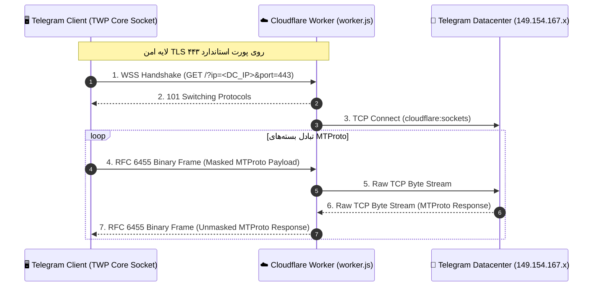

<div align="center">

# ⚡ TWP (Telegram Worker Proxy) Core

**High-Performance MTProto-over-WebSocket Transport Engine & Protocol Specification**  
*هسته پروتکل و موتور تونلینگ کلاینت-سرور تلگرام بر پایه ورکر کلادفلر*

[](LICENSE)
[-orange.svg)](https://workers.cloudflare.com)
[-purple.svg)](docs/PROTOCOL.md)
[](docs/PROTOCOL.md)

[معرفی هسته (FA)](#-معرفی-هسته-twp-core) • [Core Overview (EN)](#-core-overview-en) • [Architecture](#-معماری-پروتکل-architecture) • [Server Engine](#-موتور-سرور-server-engine) • [Client Integration](#-یکپارچه‌سازی-کلاینت-client-integration) • [Protocol Spec](#-مشخصات-پروتکل-protocol-spec)

</div>

---

## 📖 معرفی هسته (TWP Core)

پروژه **TWP (Telegram Worker Proxy)** یک هسته سبک، ماژولار و متن‌باز برای انتقال ترافیک پروتکل MTProto تلگرام از طریق شبکه توزیع‌شده Cloudflare Workers است. 

این مخزن به عنوان **هسته مرجع (Reference Core Implementation)** و **مستندات پروتکل** عمل می‌کند و به توسعه‌دهندگان، سازندگان کلاینت‌های تلگرام و مدیران شبکه این امکان را می‌دهد تا بدون نیاز به سرورهای سنتی VPS، ارتباطی امن، ضد فیلتر و پرسرعت را میان کلاینت‌های تلگرام و دیتاسنترهای رسمی برقرار کنند.

---

## 🌟 اجزای تشکیل‌دهنده هسته (Core Components)

| بخش | مسیر در مخزن | شرح وظیفه |
| :--- | :--- | :--- |
| **Server Core Engine** | [`worker.js`](worker.js) | موتور سرورلس کلادفلر با استفاده از `cloudflare:sockets` برای تبدیل فریم‌های WSS به اتصال TCP دیتاسنترهای تلگرام |
| **Client Core Engine** | [`client/src/`](client/src/) | پیاده‌سازی مرجع سوکت کلاینت (C++20) مشتق از `AbstractSocket` برای تزریق به کلاینت‌های تلگرام |
| **Protocol Specification** | [`docs/PROTOCOL.md`](docs/PROTOCOL.md) | استاندارد لینک‌های `tg://worker?...`، نحوه فریم‌بندی RFC 6455 و احراز هویت با سکرت |
| **Architecture Docs** | [`docs/ARCHITECTURE.md`](docs/ARCHITECTURE.md) | مدل فنی، جریان داده‌ها و مقایسه امنیتی و عملکردی با MTProxy و SOCKS5 |
| **Diagnostics CLI** | [`scripts/test-worker.js`](scripts/test-worker.js) | اسکریپت تشخیصی مستقل خط فرمان برای تست اتصال و اندازه‌گیری پینگ دیتاسنترها |

---

## 🏗️ معماری پروتکل (Architecture)



---

## ☁️ موتور سرور (Server Engine: `worker.js`)

موتور سرور یک اسکریپت مستقل جاوااسکریپت برای محیط رانتایم Cloudflare Workers است. این موتور:
1. ارتباط وب‌سوکت دوطرفه امن (Full-Duplex WSS) را با کلاینت برقرار می‌کند.
2. با استفاده از ماژول استاندارد `cloudflare:sockets`، یک سوکت خام TCP به IP و پورت دیتاسنتر مورد نظر تلگرام باز می‌کند.
3. با استفاده از بافرهای `ArrayBuffer` و مدیریت هوشمند جریان داده، پکت‌ها را با کمترین تأخیر ممکن (Zero-Copy Streaming) بین دو سوکت رد و بدل می‌کند.
4. در صورت اتصال مرورگر به آدرس ورکر، یک صفحه وب سبک برای تست وضعیت و مشخصات سرور نمایش می‌دهد.

### استقرار هسته سرور:

```bash
# ۱. کلون کردن ریپازیتوری
git clone https://github.com/your-username/TWP.git
cd TWP

# ۲. ورود به اکانت کلادفلر
npx wrangler login

# ۳. استقرار فوری
npx wrangler deploy
```

یا کپی کردن مستقیم محتوای [`worker.js`](worker.js) در ویرایشگر داشبورد Cloudflare.

---

## 💻 یکپارچه‌سازی کلاینت (Client Integration)

توسعه‌دهندگان کلاینت‌های تلگرام (شامل Telegram Desktop، تلگرام‌های غیررسمی اندروید، ربات‌ها و ابزارهای واسط) می‌توانند از کدهای آماده پوشه [`client/src/`](client/src/) استفاده کنند:

- [`mtproto_worker_socket.h`](client/src/mtproto_worker_socket.h): تعریف کلاس سوکت کلاینت با متدهای استاندارد `AbstractSocket`.
- [`mtproto_worker_socket.cpp`](client/src/mtproto_worker_socket.cpp): پیاده‌سازی کامل استتار فریم‌ها، ماسک تصادفی ۴ بایتی، و تبدیل دیتای خام به WSS.
- [`integration_guide.md`](client/src/integration_guide.md): راهنمای گام‌به‌گام تزریق کد به پروژه‌های مبتنی بر Qt / C++.

---

## 📜 مشخصات پروتکل (Protocol Spec)

### ساختار URL Scheme:
کلاینت‌های منطبق با استاندارد TWP باید از فرمت زیر پشتیبانی کنند:

```text
tg://worker?server=<worker_hostname>&port=443[&secret=<optional_secret>]
```

- **`server`**: دامنه ورکر کلادفلر (مثلاً `my-proxy.workers.dev`).
- **`port`**: پورت امن WSS (پیش‌فرض: `443`).
- **`secret`**: توکن اختیاری هماهنگ با متغیر محیطی `SECRET` در ورکر جهت کنترل دسترسی.

برای جزئیات کامل فریم‌بندی RFC 6455 و رویکردهای مسیریابی به [docs/PROTOCOL.md](docs/PROTOCOL.md) مراجعه کنید.

---

## 🧪 ابزار خط فرمان تست هسته (Diagnostics CLI)

برای اطمینان از عملکرد صحیح و بررسی پینگ سرور ورکر با دیتاسنترهای رسمی تلگرام:

```bash
node scripts/test-worker.js <worker_domain> [optional_secret]
```

---

## 🌐 Core Overview (EN)

**TWP** is an open protocol specification and reference core implementation that bridges Telegram MTProto network traffic through the Cloudflare Workers serverless edge via secure WebSockets.

- **Zero VPS Cost:** Runs fully on Cloudflare serverless edge infrastructure.
- **DPI-Immune Transport:** Pure HTTPS / WSS traffic over standard Port 443 with TLS 1.3 encryption.
- **Extensible:** Designed for easy embedding into any existing Telegram client codebase or custom proxy bridges.

---

## 📄 مجوز (License)

این هسته تحت مجوز **MIT License** منتشر شده است و هرگونه استفاده، توسعه یا ادغام آن در کلاینت‌های تجاری و متن‌باز بلامانع است.