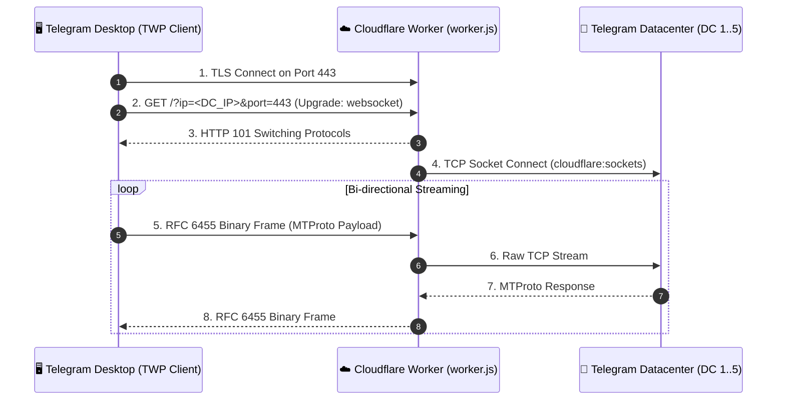

<div align="center">

# ⚡ TWP (Telegram Worker Proxy)

**The First Native Cloudflare Worker Proxy Engine for Telegram Desktop**  
*اولین موتور پروکسی اختصاصی و نیتیو بر پایه ورکر کلادفلر برای تلگرام دسکتاپ*

[](LICENSE)
[](https://workers.cloudflare.com)
[](#)
[-purple.svg)](#)

[راهنمای فارسی](#-راهنمای-فارسی) • [English Guide](#-english-guide) • [Deploy Worker](#-استقرار-در-کلادفلر-deploy-worker) • [Client Downloads](#-دریافت-نسخه-آماده-تلگرام-desktop-releases)

</div>

---

## 🌟 ویژگی‌های برجسته (Key Features)

- 🚀 **پروتکل نیتیو WSS/TLS:** ترافیک تلگرام در قالب فریم‌های امن وب‌سوکت روی پورت استاندارد ۴۴۳ استتار می‌شود.
- 🛡️ **ضد فیلتر و ردیابی‌ناپذیر:** استفاده از شبکه توزیع‌شده Anycast کلادفلر با صدها سرور در سراسر جهان.
- ⚡ **پینگ و پهنای باند استثنایی:** ارتباط مستقیم با دیتاسنترهای رسمی تلگرام با استفاده از `cloudflare:sockets`.
- 💻 **پشتیبانی مستقیم در رابط کاربری تلگرام دسکتاپ:** دارای گزینه اختصاصی **WORKER** در کنار MTProto و SOCKS5.
- 🔗 **لینک‌های اشتراک‌گذاری یک‌کلیکی:** پشتیبانی از پروتکل اختصاصی `tg://worker?...` و اشتراک‌گذاری با بارکد QR.
- 🔑 **احراز هویت با سکرت اختصاصی:** امکان قفل کردن ورکر با توکن برای استفاده شخصی یا خصوصی.
- 🌐 **داشبورد تحت وب خودکار:** دارای صفحه فرود و مدیریت شیک برای کاربران در مرورگر.

---

## 🏗️ ساختار معماری (Architecture)



---

## 🚀 استقرار در کلادفلر (Deploy Worker)

### روش ۱: استقرار سریع در ۲ دقیقه از پنل وب (پیشنهادی)

1. وارد داشبورد [Cloudflare Dashboard](https://dash.cloudflare.com) شوید.
2. به بخش **Workers & Pages** رفته و دکمه **Create Application -> Create Worker** را بزنید.
3. نام دلخواه انتخاب کرده و دکمه **Deploy** را بزنید.
4. روی **Edit code** کلیک کرده و تمام محتویات فایل [`worker.js`](worker.js) را کپی و در ادیتور پیست کنید.
5. دکمه **Save and Deploy** را بزنید.
6. تبریک! دامنه اختصاصی شما (مانند `https://my-proxy.workers.dev`) آماده اتصال است.

> [!TIP]
> **رمزگذاری اختیاری ورکر:**
> در تنظیمات ورکر در کلادفلر (`Settings -> Variables and Secrets`) متغیری با نام `SECRET` بسازید و رمز دلخواه بگذارید تا دیگران نتوانند از ترافیک ورکر شما استفاده کنند.

### روش ۲: با خط فرمان (Wrangler CLI)

```bash
# نصب وابستگی‌ها و لاگین در کلادفلر
npm install
npx wrangler login

# دیپلوی با یک دستور
npm run deploy
```

---

## 📥 دریافت نسخه آماده تلگرام (Desktop Releases)

برای استفاده از تلگرام با قابلیت داخلی ورکر نیازی به هیچ کامپایلی ندارید:
1. به تب [**Releases**](https://github.com/your-username/TWP/releases) این مخزن مراجعه کنید.
2. آخرین نسخه فشرده **Telegram-TWP-Portable.zip** را دانلود و اجرا کنید.
3. در تنظیمات تلگرام: **Settings -> Advanced -> Connection type -> Add proxy**.
4. گزینه **WORKER** را انتخاب کنید و آدرس ورکر خود را وارد نمایید.
5. تمام! تلگرام فوراً بدون نیاز به هیچ فیلترشکنی آنلاین می‌شود.

---

## 🧪 تست سلامت و پینگ ورکر از خط فرمان

می‌توانید ارتباط ورکر خود با دیتاسنترهای تلگرام را مستقیماً از CLI تست کنید:

```bash
node scripts/test-worker.js your-worker.workers.dev [optional_secret]
```

خروجی نمونه:
```text
========================================================
       TWP - Telegram Worker Proxy Health Check         
========================================================
Target Worker : https://my-worker.workers.dev
--------------------------------------------------------
1. Testing HTTP Web Dashboard... [PASS] (Status: 200, Latency: 210ms)
2. Testing WebSocket MTProto Bridge to Telegram DC 2... Connected (120ms). Sending ping... [PASS] (Received 64 bytes from DC, RTT: 240ms)
========================================================
Health check complete.
```

---

## 📂 ساختار مخزن (Repository Layout)

```text
TWP/
├── worker.js               # اسکریپت تک‌فایلی مستقل کلادفلر ورکر
├── wrangler.toml           # فایل تنظیمات Wrangler CLI
├── package.json            # اسکریپت‌ها و وابستگی‌های پروژه
├── client/
│   ├── src/                # کدهای کلاینت C++ برای ادغام در تلگرام
│   │   ├── mtproto_worker_socket.h
│   │   ├── mtproto_worker_socket.cpp
│   │   └── integration_guide.md # راهنمای افزودن به سایر فورک‌های تلگرام
│   └── README.md
├── docs/
│   ├── ARCHITECTURE.md     # معماری مهندسی و پروتکل لایه انتقال
│   ├── DEPLOY_CLOUDFLARE.md# راهنمای قدم به قدم تصویری کلادفلر
│   └── PROTOCOL.md         # مشخصات پروتکل tg://worker و فریم‌ها
└── scripts/
    └── test-worker.js      # ابزار تست خودکار سلامت و پینگ سرور
```

---

## 🤝 مشارکت (Contributing)

ما مشتاقانه از مشارکت برنامه‌نویسان استقبال می‌کنیم:
- پیاده‌سازی پروتکل در کلاینت‌های **Telegram Android** یا **Telegram iOS / macOS**.
- افزودن پشتیبانی از سرورهای اختصاصی CDN دیگر.
- گزارش باگ‌ها و ارسال Pull Request.

---

## 📄 مجوز (License)

این پروژه تحت مجوز **MIT License** منتشر شده است. استفاده، تغییر و بازتوزیع آن کاملاً آزاد و رایگان است.