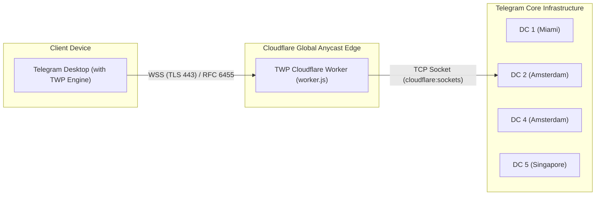

# TWP Technical Architecture

This document describes the internal engineering, data flow, and networking model of the **Telegram Worker Proxy (TWP)** ecosystem.

---

## 1. High-Level Overview



---

## 2. Why TWP Outperforms Traditional MTProxy & SOCKS5

| Feature | Standard SOCKS5 | Standard MTProto Proxy | **TWP (Cloudflare Worker)** |
| :--- | :--- | :--- | :--- |
| **Transport Layer** | Raw TCP (Easy to fingerprint) | TCP with fake TLS | **Standard HTTPS / WSS on Port 443** |
| **Censorship Resistance** | Low (Blocked by IP/SNI) | Medium (Active probing targets it) | **Maximum** (Uses Cloudflare Anycast CDN) |
| **Server Infrastructure** | Requires VPS ($5/mo+) | Requires VPS ($5/mo+) | **Serverless (Cloudflare Free Tier)** |
| **Anycast Routing** | Single IP / Single Datacenter | Single IP / Single Datacenter | **Global Anycast (200+ Cities worldwide)** |
| **DDoS Protection** | None | Limited | **Cloudflare Enterprise Edge Shielding** |
| **Client UI Integration** | Manual Host/Port/User/Pass | Server/Port/Secret | **Native Worker Mode with One-Click `tg://worker?...`** |

---

## 3. Communication Lifecycle

### Step 1: Secure Tunnel Initialization
1. The Telegram client discovers the target Telegram DC address (e.g., `149.154.167.50:443`).
2. `WorkerSocket` connects to the Cloudflare Worker domain over port 443 using standard TLS encryption (`QSslSocket`).
3. An HTTP Upgrade request is dispatched:
   ```http
   GET /?ip=149.154.167.50&port=443 HTTP/1.1
   Host: your-worker.workers.dev
   Upgrade: websocket
   Connection: Upgrade
   Sec-WebSocket-Key: <16-byte random base64>
   Sec-WebSocket-Version: 13
   ```
4. The Worker validates optional `secret` tokens and responds with `101 Switching Protocols`.

### Step 2: Outbound TCP Connect
1. Inside the Cloudflare Worker, `import { connect } from 'cloudflare:sockets'` immediately establishes a raw TCP socket to the specified Telegram Datacenter IP and port.
2. The WebSocket streams are converted to `arraybuffer` to ensure zero serialization overhead.

### Step 3: Bi-directional MTProto Streaming
1. Client-to-Server MTProto frames are encapsulated into standard binary WebSocket frames (Opcode `0x02`), masked according to RFC 6455.
2. The Worker unmasks the payload and streams it directly to the Telegram DC socket writable stream.
3. Telegram DC replies with MTProto response packets, which the Worker encapsulates back into binary WebSocket frames and streams down to the client.